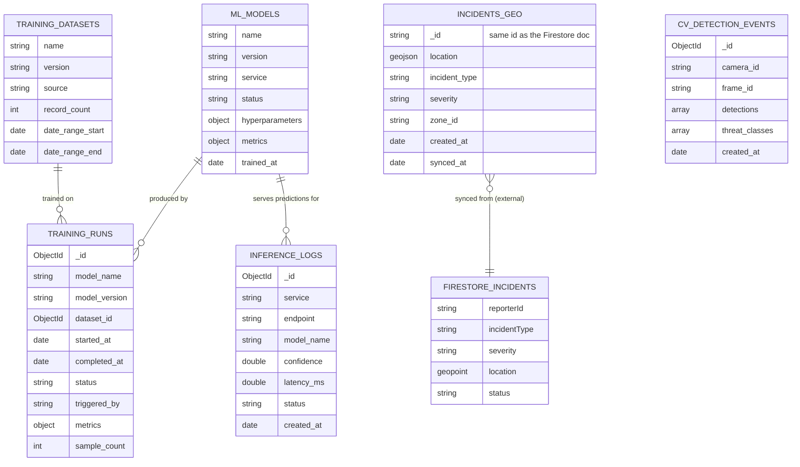

# SecureCity AI — MongoDB Schema (ai_engine / cv_engine ML Data)

## Scope

**This is not the app database.** `Users`, `Incidents`, `Notifications`,
`Journey History`, `Emergency Contacts`, `Chat History`, and every other
citizen/authority-facing collection live in **Firestore** — see
`firestore.rules` at the repo root, and `mobile/`/`dashboard/`, which are
built against it.

MongoDB is scoped to exactly one thing: `backend/ai_engine` and
`backend/cv_engine`'s own **internal ML operational data** — model
versions, training history, and inference/detection logs. Nothing here is
ever read by the mobile app or the authority dashboard.

The one exception is `incidents_geo`, a **read-only cache**, not a second
source of truth — see below.

## Why MongoDB here and not Firestore

Firestore has no native geospatial query beyond simple bounding-box
tricks — no `$geoWithin`/`$nearSphere` equivalent. `ai_engine`'s KDE crime
heatmap and its retraining pipeline both need exactly that (find incidents
within a radius/box, fast, at up to 10k documents per call). MongoDB's
`2dsphere` index is built for this. Rather than force geospatial logic
into Firestore or bolt on a geohashing scheme, `incidents_geo` mirrors the
subset of Firestore's `incidents` fields this workload needs, kept current
by a Firestore trigger (`syncIncidentGeoCache` in `functions/src/index.ts`).

The other five collections (model registry, training runs, training
datasets, inference logs, cv detection events) are pure ML/ops bookkeeping
that was never app data to begin with — they're modeled here because
that's genuinely where they've always lived (`ai_engine`'s `main.py` and
`heatmap_service.py` already connected to Mongo before this document
existed; they just had nothing correctly wired up yet, see "Bug fixed"
below).

## Bug fixed by this design

`heatmap_service.py` and `retrain_crime_model.py` already queried a Mongo
`incidents` collection for crime geodata — but nothing ever wrote to it.
Every heatmap request and every model retraining run was silently
operating on an empty collection. This design closes that gap: the
collection is renamed to `incidents_geo` (to stop implying it's the same
thing as Firestore's `incidents`) and a real sync path
(`syncIncidentGeoCache` → `POST /internal/incidents-geo/sync`) keeps it
populated.

## ER Diagram



`ML_MODELS`↔`TRAINING_RUNS` and `TRAINING_DATASETS`↔`TRAINING_RUNS` are
soft references (`model_name`/`dataset_id` fields, no foreign keys —
MongoDB has none) rather than embedded documents, since training history
and dataset metadata both grow unboundedly and are queried independently
of the model doc.

## Collections reference

| Collection | Written by | Read by | Retention |
|---|---|---|---|
| `ml_models` | `ml_repository.upsert_model_registry()` (after training) | `/models/status` (future), aggregation pipelines | indefinite |
| `training_runs` | `ml_repository.record_training_run()` | `model_performance_trend()` pipeline | indefinite |
| `training_datasets` | (not yet written — reserved for when dataset versioning is built) | — | indefinite |
| `inference_logs` | Every `/predict/*` endpoint, via `BackgroundTasks` | `inference_volume_by_endpoint()` pipeline | **90 days (TTL)** |
| `cv_detection_events` | `cv_engine`'s `/analyze/image`, only when a security-threat detection is present | ops/audit review | **180 days (TTL)** |
| `incidents_geo` | `syncIncidentGeoCache` Cloud Function → `POST /internal/incidents-geo/sync` | `HeatmapService`, `retrain_crime_model.py` | mirrors Firestore (deleted on incident delete) |

Full field-level schemas are the `$jsonSchema` validators in
`backend/ai_engine/app/core/database.py` (`_VALIDATORS`) — that file is the
source of truth; this table is a summary, not a duplicate to keep in sync
by hand.

## Indexes

| Collection | Index | Why |
|---|---|---|
| `ml_models` | unique `(name, version)` | one registry entry per model version |
| `ml_models` | `status`, `service` | dashboard/ops queries ("all active models") |
| `training_runs` | `(model_name, started_at desc)` | "latest runs for this model" is the only query pattern |
| `training_datasets` | unique `(name, version)` | one entry per dataset version |
| `inference_logs` | `(endpoint, created_at desc)` | per-endpoint volume/latency dashboards |
| `inference_logs` | TTL on `created_at`, 90 days | append-only, high volume — auto-expire instead of a cleanup job |
| `cv_detection_events` | `(camera_id, created_at desc)` | "recent detections for this camera" |
| `cv_detection_events` | multikey on `threat_classes` | "all fire detections this week" style queries |
| `cv_detection_events` | TTL on `created_at`, 180 days | longer than inference_logs — these are security-relevant, worth a longer audit trail |
| `incidents_geo` | `2dsphere` on `location` | `$geoWithin`/`$nearSphere` — the entire reason this collection exists |
| `incidents_geo` | `(incident_type, created_at desc)` | heatmap filtering by type + recency |
| `incidents_geo` | `zone_id` | `crime_density_by_zone()` pipeline (see note below — mostly unpopulated today) |

**Known gap:** `zone_id` isn't populated by the mobile app today
(`report_incident_screen.dart`'s write payload has no zone field) — the
sync function passes `null` when absent. The index and the
`crime_density_by_zone` pipeline are ready for when zone derivation
(reverse-geocoding to a patrol zone, most likely) is built — GIS-phase
scope, not this pass.

## Validation

Every collection is created with a `$jsonSchema` validator
(`validationLevel: "moderate"` — existing documents that predate the
validator aren't retroactively checked, new/modified documents are). This
means direct writes (a future admin script, a one-off `mongosh` fix) are
held to the same shape as the application code, not just whatever Pydantic
happens to check at the API boundary. See `_VALIDATORS` in
`backend/ai_engine/app/core/database.py` and the equivalent in
`backend/cv_engine/app/core/database.py` for the exact schemas.

## Aggregation pipelines

All three are implemented as real, callable functions in
`backend/ai_engine/app/core/ml_repository.py` — not just documented here.

**1. Model performance trend** (`model_performance_trend`) — weekly bucket
of a model's training run metrics, for tracking drift/improvement over
time:
```python
[
  {"$match": {"model_name": model_name, "status": "completed"}},
  {"$sort": {"started_at": -1}},
  {"$limit": weeks},
  {"$project": {"week_start": {"$dateTrunc": {"date": "$started_at", "unit": "week"}}, "metrics": 1}},
  {"$sort": {"week_start": 1}},
]
```

**2. Inference volume by endpoint** (`inference_volume_by_endpoint`) —
daily request count, average latency, and error count per endpoint, for
capacity planning and alerting:
```python
[
  {"$match": {"created_at": {"$gte": since}}},
  {"$group": {
      "_id": {"endpoint": "$endpoint", "day": {"$dateTrunc": {"date": "$created_at", "unit": "day"}}},
      "request_count": {"$sum": 1},
      "avg_latency_ms": {"$avg": "$latency_ms"},
      "error_count": {"$sum": {"$cond": [{"$eq": ["$status", "error"]}, 1, 0]}},
  }},
  {"$sort": {"_id.day": -1, "_id.endpoint": 1}},
]
```

**3. Crime density by zone** (`crime_density_by_zone`) — incident count
per zone over a trailing window, from the synced geo cache (see the
`zone_id` gap noted above — returns nothing meaningful until zone
derivation exists):
```python
[
  {"$match": {"created_at": {"$gte": since}, "zone_id": {"$ne": None}}},
  {"$group": {"_id": "$zone_id", "incident_count": {"$sum": 1}, "types": {"$addToSet": "$incident_type"}}},
  {"$sort": {"incident_count": -1}},
]
```

## Optimization notes

- **TTL indexes over cron cleanup jobs.** `inference_logs` and
  `cv_detection_events` are both append-only and high write volume; a
  scheduled deletion job is one more thing to operate and monitor. MongoDB
  expires documents past their TTL automatically, no task needed.
- **`incidents_geo` writes are single-document upserts, not bulk sync.**
  The Firestore trigger fires per-document, so this stays a targeted
  `replace_one(upsert=True)` keyed on the Firestore document ID — no
  full-collection re-sync job, no drift-reconciliation cron (acceptable
  given Firestore triggers are reliable; a reconciliation job would be the
  first thing to add if sync gaps are ever observed in production).
- **`inference_logs` writes never block the response.** Every write goes
  through FastAPI's `BackgroundTasks` and swallows its own exceptions
  (`log_inference`'s `try/except`) — a Mongo hiccup degrades observability,
  never availability.
- **Read patterns are all covered by a compound index, not a collection
  scan.** Every query in `ml_repository.py` has a matching index in the
  table above; there is deliberately no ad-hoc query path that would need
  `explain()`-driven tuning later.

## Backup strategy

- **What**: `mongodump --archive --gzip` against the `securecity_ml`
  database, run from `infrastructure/mongodb/backup.sh`.
- **When**: daily, via cron (the script is designed to be invoked by cron
  or a Kubernetes CronJob — it takes no interactive input and exits
  non-zero on failure for alerting).
- **Where**: written to a mounted volume/object storage path
  (`$BACKUP_DEST`, defaults to `./backups/mongodb`); point this at S3/GCS
  in production via `rclone`/`aws s3 cp` in the same script rather than a
  second tool.
- **Retention**: the script keeps the last 14 daily archives locally and
  deletes older ones — pair with your object storage's own lifecycle
  policy for longer-term retention if compliance requires it.
- **Restore**: `mongorestore --archive=<file> --gzip --drop` — `--drop`
  because this is operational data being restored wholesale after an
  incident, not merged with live data.
- **What's deliberately not backed up specially**: `incidents_geo` is a
  cache — if lost, it can be fully rebuilt by replaying `syncIncidentGeoCache`
  against Firestore's existing `incidents` collection (a one-time backfill
  script, not built in this pass since nothing has needed it yet).

## Cross-service secret alignment

`ai_engine`'s `settings.INTERNAL_SERVICE_TOKEN` and the Cloud Function's
`AI_ENGINE_INTERNAL_TOKEN` secret (`functions/src/index.ts`) must hold the
**same value** — they're two different env var names on two different
platforms (FastAPI env var vs. Firebase Functions secret), not a typo.
Set the Firebase secret with:
```
firebase functions:secrets:set AI_ENGINE_INTERNAL_TOKEN
```
and set `AI_ENGINE_INTERNAL_URL` (a non-secret param) to wherever
`ai_engine` is actually reachable from Cloud Functions (a public HTTPS
endpoint behind the existing nginx reverse proxy in production — Cloud
Functions cannot reach a bare `docker-compose` internal hostname).
